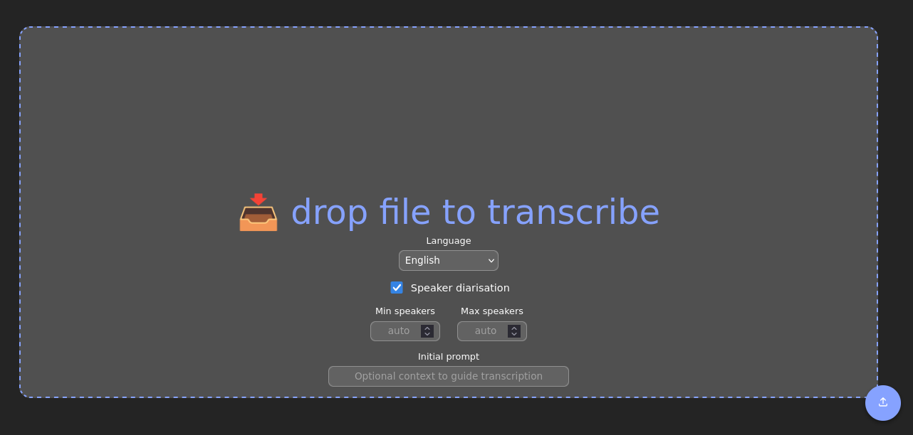

# WhisperX Web 

Basic Drop-and-Transcribe web UI and backend for WhisperX transcription.

Fork of [one-among-us/whisper-web](https://github.com/one-among-us/whisper-web) swapping `faster-whisper` for [WhisperX](https://github.com/m-bain/whisperX)

## Features

* Speech-to-text with timestamps
* Speaker diarisation

## Multi-user model

This service does not use accounts or passwords. Each uploaded file is assigned a random, unguessable link (UUID) that is used to check progress and download the transcript — Anyone who has that link can access the results, so it should be treated like a private URL and not shared. 

There is no way for other users to browse, list, or guess another user's files under normal circumstances, and the original audio file is never exposed for download; only the transcript is. The uploaded audio is deleted as soon as transcription finishes — successfully or not — so recordings are not kept on disk after the job that needed them. Transcripts are kept, and their retention is up to the operator (see below). 

Uploads are processed one at a time in a first-in, first-out queue — If you upload while another job is running, your file waits its turn, and the progress page shows your position in the queue along with live CPU/GPU usage once your file starts processing. 

Two limits keep one user from monopolising that queue. The whole service accepts `MAX_QUEUE_DEPTH` jobs at once (uploads beyond that are refused until a slot frees), and any single user may have `MAX_JOBS_PER_CLIENT` jobs queued or running at once. Both are refused at upload time with an explanatory message, and both clear themselves as jobs finish — there is no lasting penalty.

## Deployment

Two containers: a frontend (nginx serving the built SPA) and a backend (FastAPI
+ WhisperX, needs an NVIDIA GPU).
 
#### K8s notes
* Proxy backend on `/api` for a same-origin setup; Set backend service in nginx.conf. 
* When using ingress, set Ingress body-size limit to at least `MAX_UPLOAD_MB`, or large uploads
  fail at the Ingress before reaching the app. On ingress-nginx:
  `nginx.ingress.kubernetes.io/proxy-body-size: 512m`.
* Transcription is slow. Raise the Ingress read/send timeouts (e.g.
  `proxy-read-timeout: "3600"`) so long jobs are not cut off.
* The backend needs `nvidia.com/gpu` in its resource limits and writable storage
  at `/ws/tmp-whisper` — use a PVC, since results are lost on pod restart
  otherwise. Uploads are processed one at a time, so run a single replica.
* `MAX_JOBS_PER_CLIENT` identifies users by the `X-Real-IP` header the proxy
  sets. Keep the backend reachable only through that proxy: if it is exposed
  directly, clients can set the header themselves and bypass the limit. The
  queue state is in-memory and per-pod, so both limits assume the single replica
  above and reset on restart.
* The upload rate/concurrency limits in `front/nginx.conf` key on
  `$remote_addr`. Behind an Ingress or CDN that is the *proxy's* address, so
  every user collapses into one key and the limits apply globally — one user's
  uploads would then block everyone. Uncomment the `set_real_ip_from` /
  `real_ip_header` lines in that file and set them to the trusted proxy range.
  The same applies to the `X-Real-IP` the backend uses. These limits are also
  per-nginx-pod, so scale the frontend and each replica gets its own budget.

#### Storage retention

`/ws/tmp-whisper` holds two directories with different lifecycles:

* `audio/` — uploads, up to `MAX_UPLOAD_MB` each. Deleted by the app as soon as
  the job finishes, so peak usage is bounded by the queue depth rather than by
  total traffic. No cleanup job is needed for these; a periodic sweep of files
  older than a day or so is still worth having as a backstop for uploads
  orphaned by a pod crash mid-job, but it should normally find nothing.
* `transcription/` — the JSON results, a few KB each. These are the product and
  are never deleted by the app, so they grow without bound. Expire them on
  whatever schedule suits; note that doing so breaks the UUID link for anyone
  who bookmarked it, since the page re-fetches the transcript from the server on
  every load.

`k8s/cleanup-cronjob.yaml` is a starting point covering both — check the PVC
name, namespace, schedule and retention window before applying.

### Environment variables

Frontend:
* `BACKEND_HOST` - backend URL. Defaults to `/api` (proxied to the backend).
  Set an absolute URL only if the backend is exposed separately; that makes
  requests cross-origin, so the backend's `CORS_ORIGINS` must then list this
  frontend's origin.
* `TITLE` - optional header title

Backend:
* `HF_TOKEN` - huggingface api token
* `MAX_UPLOAD_MB` - maximum accepted upload size in MB (default `512`). Make sure to also set `client_max_body_size` accordingly in `front/nginx.conf`
* `MAX_AUDIO_SECONDS` - maximum audio duration in seconds (default `14400`, 4h). Over-length files
  are rejected before decoding.
* `FFMPEG_TIMEOUT` - seconds before a decode is abandoned (default `1800`).
* `CORS_ORIGINS` - comma-separated list of browser origins allowed to call the
  API, e.g. `https://whisper.internal.example`. Defaults to `*`. Not needed in
  the default same-origin setup (/api) above.
* `MAX_QUEUE_DEPTH` - total jobs queued or running at once, across all users
  (default `10`). Further uploads are refused with `503` until a slot frees.
* `MAX_JOBS_PER_CLIENT` - jobs a single user may have queued or running at once
  (default `2`). Further uploads are refused with `429` until one finishes.

## LLM Disclosure 🤖🧠

The WhisperX integration and additional features in this fork were added using AI agents as pair programmer.
I recognise LLM use is ethically complex and carries a heavy environmental burden. As a non-programmer, I aim to thoughtfully balance the use of LLMs against the value it provides.
